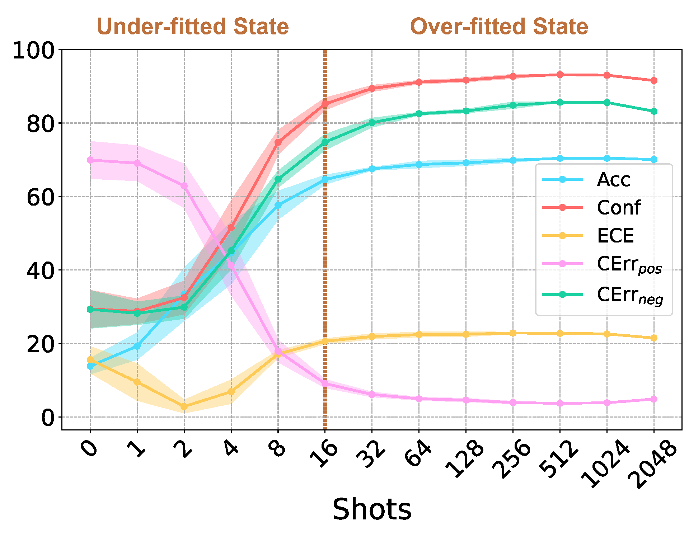

<!-- 




 -->

Hongcheng Gao(高鸿成) is a second-year Master student at <a href="https://www.ucas.ac.cn//">UCAS</a>. He received his Bachelor's degree of Computer Science and Technology at <a href="https://cqu.edu.cn/">Chongqing University</a> in June 2023. In his undergraduate years, he was a research intern at <a href="http://nlp.csai.tsinghua.edu.cn">THUNLP</a>,  advised by <a href="http://nlp.csai.tsinghua.edu.cn/~lzy/">Prof. Zhiyuan Liu</a>. In the early stages of his research, he worked closely with <a href="https://yangyi-chen.github.io/">Yangyi Chen</a> and received great help from him. Nowadays, he is advised by <a href="https://thudzj.github.io/">Zhijie Deng</a>, <a href="https://p2333.github.io/">Tianyu Pang</a> and <a href="https://duchao0726.github.io/">Chao Du</a> at <a href="https://sail.sea.com/">SAIL</a>.

<!-- and <a href="https://vipl.ict.ac.cn/">VIPL</a>(<a href="http://www.ict.ac.cn/">ICT</a>) -->
<!-- Hongcheng Gao(高鸿成) is nobody just hoping to make some meaningful works. His research interests lie in <strong>trustworthy NLP, large language modeling and multi-modal learning. -->

<!-- Curently, he is also a core member of <a href="https://huggingface.co/WizardLM">WizardLM Team</a> of <a href="https://www.msra.cn/">Microsoft Research</a>. -->

<!-- He received Bachelor's degree of Computer Science and Techology at <a href="https://cqu.edu.cn/">Chongqing University</a> in June 2023. In his undergraduate years, He was a research intern at <a href="http://nlp.csai.tsinghua.edu.cn">THUNLP</a>,  advised by <a href="http://nlp.csai.tsinghua.edu.cn/~lzy/">Prof. Zhiyuan Liu</a>.   -->

<!-- He also worked with <a href="https://thudzj.github.io">Prof.Zhijie Deng</a>(<a href="https://www.sjtu.edu.cn">SJTU</a>), <a href="https://ml.cs.tsinghua.edu.cn/~yinpeng/">Post-doc Yinpeng Dong</a>(<a href="https://www.tsinghua.edu.cn/en/">THU</a>) and <a href="https://cseweb.ucsd.edu/~haozhang/">Prof.Hao Zhang</a>(<a href="https://ucsd.edu/">UCSD</a>). -->
<!--   -->

His research interests lie in <strong>trustworthy NLP, large language modeling and multi-modal learning</strong>. 

 Actively seeking PhD program opportunity for the Fall of 2026  ^_^  Please contact me if you are interested!

# 🔥 News
- *2024.09*: Three papers accepted to NeurIPS 2024 with two Spotlight.
- *2024.09*: Two papers accepted to EMNLP 2024.
- *2024.05*: One paper accepted to ACL 2024.
- *2024.04*: One paper accepted to NAACL 2024.
- *2024.01*: 🎉 One paper accepted to ICLR 2024.
- *2023.09*: 🎉 One paper accepted to NeurIPS 2023 (D&B Track).
- *2023.05*: 🎉 One paper accepted to ACL 2023!
- *2022.10*: 🎉 Two papers accepted by EMNLP 2022!
- *2022.08*: 🎉 One paper accepted by NAACL 2022!
<!-- - *2022.06*: &nbsp;🎉🎉 Our textual backdoor learning toolkit *OpenBackdoor* has been released. Please check out [here](https://github.com/thunlp/OpenBackdoor)! -->

# 📝 Preprints 
\* indicates equal contribution.
- **Meta-Unlearning on Diffusion Models: Preventing Relearning Unlearned Concepts** [\[Paper\]](https://arxiv.org/abs/2410.12777) 
**Hongcheng Gao**, Tianyu Pang, Chao Du, Taihang Hu, Zhijie Deng, Min Lin

- **Is factuality decoding a free lunch for llms? evaluation on knowledge editing benchmark** [\[Paper\]](https://arxiv.org/abs/2404.00216) 
Baolong Bi, Shenghua Liu, Yiwei Wang, Lingrui Mei, Junfeng Fang, **Hongcheng Gao**, Shiyu Ni, Xueqi Cheng

- **StruEdit: Structured Outputs Enable the Fast and Accurate Knowledge Editing for Large Language Models** [\[Paper\]](https://arxiv.org/abs/2409.10132) 
Baolong Bi, Shenghua Liu, Yiwei Wang, Lingrui Mei, **Hongcheng Gao**, Junfeng Fang, Xueqi Cheng

- **Evaluating the Robustness of Text-to-image Diffusion Models against Real-world Attacks** [\[Paper\]](https://arxiv.org/abs/2306.13103)  
**Hongcheng Gao**, Hao Zhang, Yinpeng Dong, Zhijie Deng.  
<!-- *Under Review by **NeurIPS 2023*** -->

<!-- *Under Review by **NeurIPS 2023*** -->

<!-- *Under Review by **NeurIPS 2023*** -->

<!-- - **DEPP: A Novel Crystal Descriptor and Application in Ionic Batteries Voltage Prediction**  
Dongchen Jin\*, **Hongcheng Gao\***, Haoran Luo\*, Linlin He, Chao Yang, Yujie Zheng.  
*Under Review by **npj Computational Materials** (Sister journal of **Nature**)* -->

# 📝 Publications 
\* indicates equal contribution.

<!-- <table><tr><td>
    &nbsp;</td>
    <td align="left">
    

      <b>A Close Look into the Calibration of Pre-trained Language Models</b>. <a href="https://arxiv.org/abs/2211.00151">[Paper]</a> 
      Yangyi Chen*, <b>Lifan Yuan*</b>, Ganqu Cui, Zhiyuan Liu, Heng Ji.  
      <em><b>What</b></em>: An emperical study on the calibration of PLMs and existing calibration methods.  
      <em><b>Results</b></em>: Language models do not learn to be calibrated in training, and existing methods fail to tackle the miscalibration problems. 
      <em><b>Insights</b></em>: Learnable calibration methods, which directly collect data to train PLMs on the calibration task, demonstrate a great potential in improving PLMs' calibration. 
    

</td></tr></table> -->
**2024**
- **Spider2-V: How Far Are Multimodal Agents From Automating Data Science and Engineering Workflows?** [\[Paper\]](https://arxiv.org/abs/2406.13233) 
Ruisheng Cao, Fangyu Lei, Haoyuan Wu, Jixuan Chen, Yeqiao Fu, **Hongcheng Gao** et al.  
***NeurIPS 2024(Spotlight）***

- **AdaMoE: Token-Adaptive Routing with Null Experts for Mixture-of-Experts Language Models** [\[Paper\]](https://arxiv.org/abs/2406.13233) 
Zihao Zeng\*, Yibo Miao\*, **Hongcheng Gao**, Hao Zhang, Zhijie Deng.  
*Findings of **EMNLP 2024***. 

- **Adaptive Token Biaser: Knowledge Editing via Biasing Key Entities** [\[Paper\]](https://arxiv.org/abs/2406.12468)  
Baolong Bi, Shenghua Liu, Yiwei Wang, Lingrui Mei, **Hongcheng Gao**, Yilong Xu, Xueqi Cheng.  
*Findings of **EMNLP 2024***. 

- **Efficient Detection of LLM-generated Texts with a Bayesian Surrogate Model** [\[Paper\]](https://arxiv.org/abs/2305.16617) 
Zhijie Deng\*, **Hongcheng Gao\***, Yibo Miao, Hao Zhang.  
*Findings of **ACL 2024***. 

- **Universal Prompt Optimizer for Safe Text-to-Image Generation** [\[Paper\]](https://arxiv.org/abs/2402.10882)  
Zongyu Wu\*, **Hongcheng Gao\***, Yueze Wang, Xiang Zhang, Suhang Wang.  
***NAACL 2024***

- **Generative Pretraining in Multimodality** [\[Paper\]](https://arxiv.org/abs/2307.05222)  
Quan Sun\*, Qiying Yu\*, Yufeng Cui\*, Fan Zhang\*, Xiaosong Zhang\*, Yueze Wang, **Hongcheng Gao**, Jingjing Liu, Tiejun Huang, Xinlong Wang 
***ICLR 2024***

**2023**

- **Revisiting Out-of-distribution Robustness in NLP: Benchmark, Analysis, and LLMs Evaluations** [\[Paper\]](http://arxiv.org/abs/2306.04618) 
Lifan Yuan, Yangyi Chen, Ganqu Cui, **Hongcheng Gao**, Fangyuan Zou, Xingyi Cheng, Heng Ji, Zhiyuan Liu, Maosong Sun.  
***NeurIPS 2023 (D&B Track)***

- **From Adversarial Arms Race to Model-centric Evaluation: Motivating a Unified Automatic Robustness Evaluation Framework** [\[Paper\]](https://arxiv.org/abs/2305.18503) 
Yangyi Chen\*, **Hongcheng Gao\***, Ganqu Cui\*, Lifan Yuan, Dehan Kong, Hanlu Wu, Ning Shi, Bo Yuan, Longtao Huang, Hui Xue, Zhiyuan Liu, Maosong Sun, Heng Ji.  
*Findings of **ACL 2023***. 

**2022**

- **Why Should Adversarial Perturbations be Imperceptible? Rethink the Research Paradigm in Adversarial NLP** [\[Paper\]](https://arxiv.org/abs/2210.10683) 
Yangyi Chen\*, **Hongcheng Gao\***, Ganqu Cui, Fanchao Qi, Longtao Huang, Zhiyuan Liu, Maosong Sun.  
***EMNLP 2022***. 

- **Textual Backdoor Attacks Can Be More Harmful via Two Simple Tricks** [\[Paper\]](https://arxiv.org/abs/2110.08247) 
Yangyi Chen\*, Fanchao Qi\*, **Hongcheng Gao**, Zhiyuan Liu, Maosong Sun.  
***EMNLP 2022***. 

- **Exploring the Universal Vulnerability of Prompt-based Learning Paradigm** [\[Paper\]](https://aclanthology.org/2022.findings-naacl.137) 
Lei Xu, Yangyi Chen, Ganqu Cui, **Hongcheng Gao**, Zhiyuan Liu. 
*Findings of **NAACL 2022***. 

# 💻 Projects

- [RobTest](https://github.com/thunlp/RobTest): an open-source toolkit for textual model robustness evaluation . 
- [Spider2-V](https://github.com/xlang-ai/Spider2-V): Spider2-V is a multimodal agent benchmark spanning across the entire data science and engineering workflow 
- [OpenAttack](https://github.com/thunlp/OpenAttack): an open-source Python-based textual adversarial attack toolkit. 
- [Emu](https://github.com/baaivision/Emu): an open multimodal generalist for both image-to-text and text-to-image tasks.  

<!-- # 📄 Academic Services
- Journey Reviews:
<a href="https://www.springer.com/journal/10994">Machine Learning</a>,  -->

<!-- **Conference Reviews**

2023: ACL, ARR.

2022: NeurIPS, EMNLP, ARR. --> 

<!-- # 🎖 Honors and Awards
- Outstanding Graduate, HUST, 2023
- Optics Valley Morning Star Scholarship, China Optics Valley, 2022
- Scholarship for Scientific and Technological Innovation, HUST, 2022
- National Scholarship, China, 2020
- Outstanding Undergraduate, HUST, 2020
- Merit Student, HUST, 2020
- First Prize in Provinces, Chinese Chemistry Olympiad, 2018 -->

# 📖 Experiences

- *2018.09 - 2023.06*, Undergraduate Student at Chongqing University.
- *2021.06 - 2023.06*, Intern at THUNLP, Tsinghua University. Mentor: <a href="http://nlp.csai.tsinghua.edu.cn/~lzy/">Prof. Zhiyuan Liu</a>

<!-- # 💬 Invited Talks
- *2021.06*, Lorem ipsum dolor sit amet, consectetur adipiscing elit. Vivamus ornare aliquet ipsum, ac tempus justo dapibus sit amet. 
- *2021.03*, Lorem ipsum dolor sit amet, consectetur adipiscing elit. Vivamus ornare aliquet ipsum, ac tempus justo dapibus sit amet.  \| [\[video\]](https://github.com/)

# 💻 Internships
- *2019.05 - 2020.02*, [Lorem](https://github.com/), China. -->
