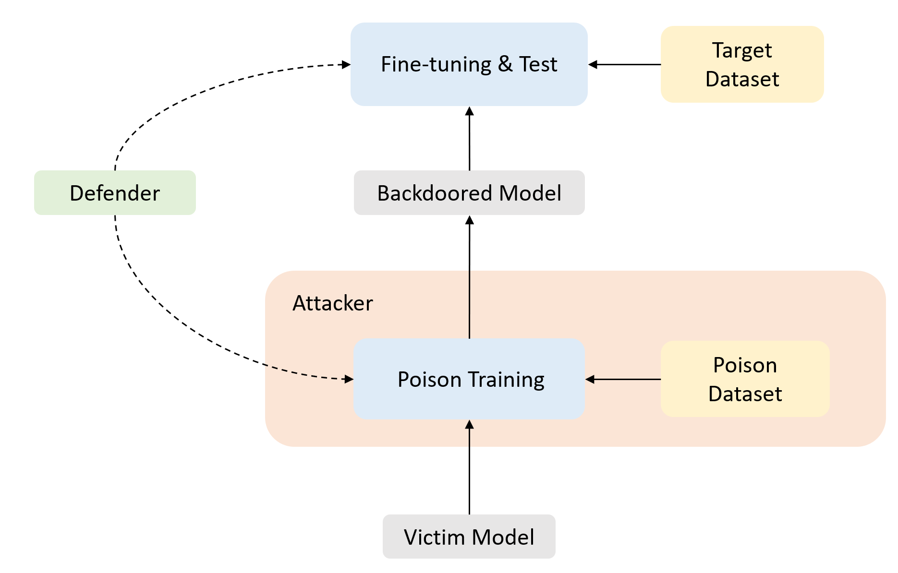

<!-- 




 -->

Hongcheng Gao(高鸿成) is a fourth-year undergraduate student in Computer Science at <a href="https://cqu.edu.cn/">Chongqing University<a>.
In his undergraduate years, He was a research intern at <a href="http://nlp.csai.tsinghua.edu.cn">THUNLP</a>, advised by <a href="http://nlp.csai.tsinghua.edu.cn/~lzy/">Prof. Zhiyuan Liu</a>.  He also worked with <a href="https://thudzj.github.io">Prof. Zhijie Deng</a>(<a href="https://www.sjtu.edu.cn">SJTU</a>) and <a href="https://people.eecs.berkeley.edu/~hao/">Dr.Hao Zhang</a>(<a href="https://www.berkeley.edu">UC Berkeley</a>).
 
My research interests lie in trustworthy NLP, large language modeling and multi-modal learning.
 

# 🔥 News
- *2023.05*：one paper is accepted to ACL 2023!
- *2022.10*: Two papers are accepted by EMNLP2022!
- *2022.08*: One paper is accepted by NAACL2022!
<!-- - *2022.06*: &nbsp;🎉🎉 Our textual backdoor learning toolkit *OpenBackdoor* has been released. Please check out [here](https://github.com/thunlp/OpenBackdoor)! -->

# 📝 Preprints 
\* indicates equal contribution.

- **Revisiting Out-of-distribution Robustness in NLP: Benchmark, Analysis, and LLMs Evaluations** [\[Paper\]](http://arxiv.org/abs/2306.04618) 
Lifan Yuan, Yangyi Chen, Ganqu Cui, <b>Hongcheng Gao</b>, Fangyuan Zou, Xingyi Cheng, Heng Ji, Zhiyuan Liu, Maosong Sun

# 📝 Publications 
\* indicates equal contribution.

<!-- <table><tr><td>
    &nbsp;</td>
    <td align="left">
    

      <b>A Close Look into the Calibration of Pre-trained Language Models</b>. <a href="https://arxiv.org/abs/2211.00151">[Paper]</a> 
      Yangyi Chen*, <b>Lifan Yuan*</b>, Ganqu Cui, Zhiyuan Liu, Heng Ji.  
      <em><b>What</b></em>: An emperical study on the calibration of PLMs and existing calibration methods.  
      <em><b>Results</b></em>: Language models do not learn to be calibrated in training, and existing methods fail to tackle the miscalibration problems. 
      <em><b>Insights</b></em>: Learnable calibration methods, which directly collect data to train PLMs on the calibration task, demonstrate a great potential in improving PLMs' calibration. 
    

</td></tr></table> -->

**2023**

- **A Close Look into the Calibration of Pre-trained Language Models** [\[Paper\]](https://arxiv.org/abs/2211.00151) 
Yangyi Chen\*, *<u>Lifan Yuan*</u>*, Ganqu Cui, Zhiyuan Liu, Heng Ji.  
*ACL 2023*. 

- **Bridge the Gap Between CV and NLP! A Gradient-based Textual Adversarial Attack Framework** [\[Paper\]](https://arxiv.org/abs/2110.15317) 
*<u>Lifan Yuan*</u>*, Yichi Zhang\*, Yangyi Chen, Wei Wei.  
*Findings of ACL 2023*. 

- **From Adversarial Arms Race to Model-centric Evaluation: Motivating a Unified Automatic Robustness Evaluation Framework** [\[Paper\]](https://arxiv.org/abs/2305.18503) 
Yangyi Chen\*, Hongcheng Gao\*, Ganqu Cui\*, *<u>Lifan Yuan</u>*, Dehan Kong, Hanlu Wu, Ning Shi, Bo Yuan, Longtao Huang, Hui Xue, Zhiyuan Liu, Maosong Sun, Heng Ji.  
*Findings of ACL 2023*. 

**2022**

- **A Unified Evaluation of Textual Backdoor Learning: Frameworks and Benchmarks** [\[Paper\]](https://arxiv.org/abs/2206.08514) 
Ganqu Cui\*, *<u>Lifan Yuan*</u>*, Bingxiang He, Yangyi Chen, Zhiyuan Liu, Maosong Sun.  
*NeurIPS 2022 ($\color{red}{Spotlight}$)*. 

- **FactMix: Using a Few Labeled In-domain Examples to Generalize to Cross-domain Named Entity Recognition** [\[Paper\]](https://arxiv.org/abs/2208.11464) 
*<u>Lifan Yuan*</u>*, Linyi Yang\*, Leyang Cui, Wenyang Gao, Yue Zhang.  
*COLING 2022 ($\color{red}{Oral}$)*. 

- **Deep Clustering and Visualization for End-to-End High-Dimensional Data Analysis** [\[Paper\]](https://ieeexplore.ieee.org/abstract/document/9732198/) 
Lirong Wu\*, *<u>Lifan Yuan*</u>*, Guojiang Zhao, Haitao Lin, Stan Z. Li. 
*IEEE Transactions on Neural Networks and Learning Systems (TNNLS)*. 

# 💻 Projects

- [OpenBackdoor](https://github.com/thunlp/OpenBackdoor): an open-source toolkit for textual backdoor attack and defense. 

 

  **Extensive implementation.** Users can easily replicate the popular attack and defense models in a few lines of code.

  **Comprehensive evaluation.** OpenBackdoor integrates multiple benchmark tasks with corresponding metrics.

  **Modularized framework.** The pipeline of backdoor attack and defense is broken down into distinct modules, enabling high extendibility.

# 📄 Academic Services

**Conference Reviews**

2023: ACL, ARR.

2022: NeurIPS, EMNLP, ARR.

# 🎖 Honors and Awards
- Outstanding Graduate, HUST, 2023
- Optics Valley Morning Star Scholarship, China Optics Valley, 2022
- Scholarship for Scientific and Technological Innovation, HUST, 2022
- National Scholarship, China, 2020
- Outstanding Undergraduate, HUST, 2020
- Merit Student, HUST, 2020
- First Prize in Provinces, Chinese Chemistry Olympiad, 2018

# 📖 Educations

- *2019.09 - 2023.06 (Expected)*, Huazhong University of Science and Technology.

<!-- # 💬 Invited Talks
- *2021.06*, Lorem ipsum dolor sit amet, consectetur adipiscing elit. Vivamus ornare aliquet ipsum, ac tempus justo dapibus sit amet. 
- *2021.03*, Lorem ipsum dolor sit amet, consectetur adipiscing elit. Vivamus ornare aliquet ipsum, ac tempus justo dapibus sit amet.  \| [\[video\]](https://github.com/)

# 💻 Internships
- *2019.05 - 2020.02*, [Lorem](https://github.com/), China. -->